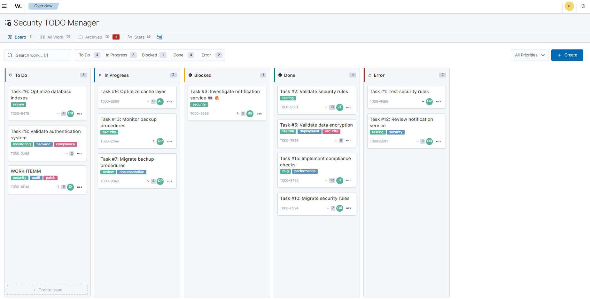
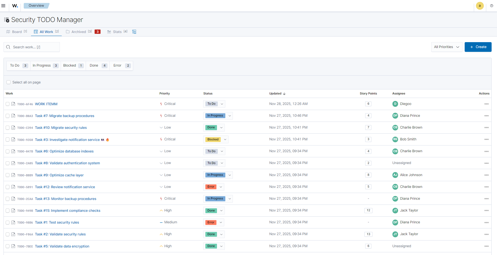
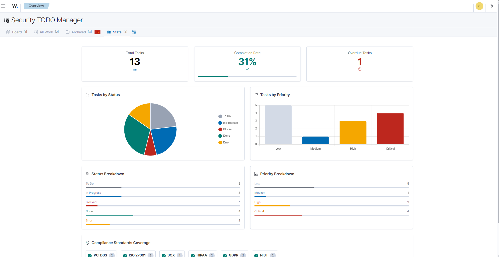
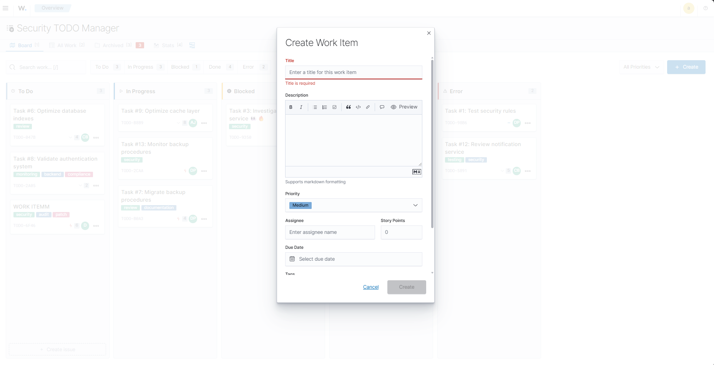
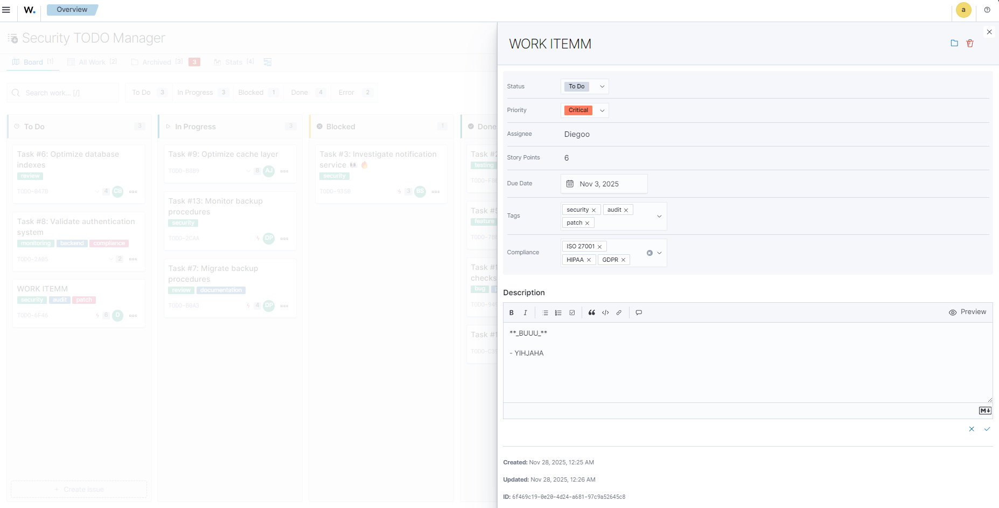
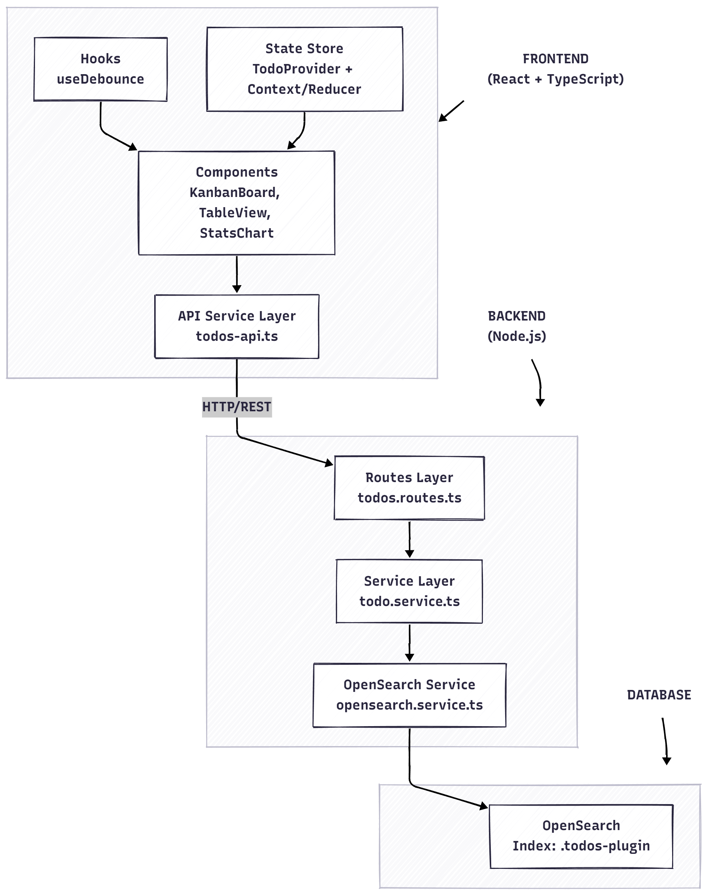

# Security Compliance TODO Plugin (Security TODO Manager)

A full-featured TODO application plugin for OpenSearch Dashboards, designed for security compliance professionals to track tasks related to security standards like PCI DSS, ISO 27001, SOX, and more.

## Table of Contents

- [Features](#features)
- [Screenshots](#screenshots)
- [Architecture](#architecture)
- [Tech Stack](#tech-stack)
- [Getting Started](#getting-started)
- [Running Tests](#running-tests)
- [API Documentation](#api-documentation)
- [Project Structure](#project-structure)
- [Challenges & Solutions](#challenges--solutions)
- [Future Improvements](#future-improvements)

---

## Features

### Core Functionality

- **CRUD Operations**: Create, read, update, and delete TODO items
- **Persistent Storage**: Data stored in OpenSearch index
- **Status Management**: Track tasks through 5 statuses (Planned, In Progress, Blocked, Done, Error)
- **Priority Levels**: 4 priority levels (Low, Medium, High, Critical)
- **Search**: Full-text search across titles and descriptions
- **Archive/Restore**: Archive completed tasks without deleting them

### Visualizations

- **Kanban Board**: Drag-and-drop interface with columns per status
- **Table View**: Sortable, paginated table with bulk operations
- **Statistics Dashboard**: Charts showing task distribution and trends
- **Archived View**: Manage archived items separately

### Advanced Features

- **Bulk Operations**: Archive/delete multiple items at once
- **Tags & Compliance Standards**: Categorize tasks by tags and security standards
- **Filtering**: Filter by status, priority, and compliance standards
- **Keyboard Shortcuts**: Quick navigation (N for new, / for search)

---

## Screenshots

### Kanban Board View



### Table View



### Statistics Dashboard



### Create/Edit TODO Modal




---

## Architecture

### Three-Layer Architecture



### Data Flow

1. **User Action** → Component triggers action
2. **API Call** → `todos-api.ts` sends HTTP request to backend
3. **Route Handler** → `todos.routes.ts` receives and validates request
4. **Service Layer** → `todo.service.ts` applies business logic
5. **OpenSearch** → `opensearch.service.ts` executes database operations
6. **Response** → Data flows back through layers to UI

---

## Tech Stack

| Layer                | Technology                             |
| -------------------- | -------------------------------------- |
| **Frontend**         | React 16.14, TypeScript                |
| **UI Components**    | @elastic/eui (OpenSearch UI)           |
| **State Management** | React Context + useReducer             |
| **Data Fetching**    | @tanstack/react-query v4               |
| **Backend**          | Node.js (OpenSearch Dashboards Plugin) |
| **Database**         | OpenSearch 2.14                        |
| **Testing**          | Jest 29, @testing-library/react        |
| **Container**        | Docker + Docker Compose                |

---

## Getting Started

### Prerequisites

- Docker Desktop or Docker Engine with Compose
- Node.js 18+ (for installing dependencies locally)
- Minimum 4GB RAM available for containers

### 1. Install Dependencies

```bash
# Navigate to the plugin source directory
cd src

# Install dependencies
npm install
```

### 2. Start the Development Environment

```bash
# Go back to root directory
cd ..

# Start containers
docker compose up -d

# Check containers are running
docker compose ps
```

### 3. Start OpenSearch Dashboards

```bash
# Access the container
docker exec -it dev_environment-osd-1 bash

# Navigate to OpenSearch Dashboards
cd /home/node/kbn

# Start the server
yarn start --no-base-path
```

Wait until you see:

```
server    log   [...] [info][server][OpenSearchDashboards][http] http server running at http://0.0.0.0:5601
```

### 4. Access the Application

- **URL**: http://localhost:5601
- **Username**: `admin`
- **Password**: `Wazuh-1234`

Navigate to: **☰ Menu → Custom Plugin**

---

## Running Tests

### Inside Docker Container (Required)

All tests must be executed within the Docker container as specified in the challenge requirements.

#### 1. Access the Container

```bash
docker exec -it dev_environment-osd-1 bash
```

#### 2. Navigate to Plugin Directory

```bash
cd /home/node/kbn/plugins/custom_plugin
```

#### 3. Run All Tests

```bash
yarn test
```

#### 4. Run Tests with Coverage

```bash
yarn test:coverage
```

Expected output:

```
Test Suites: 7 passed, 7 total
Tests:       112 passed, 112 total
Snapshots:   0 total
```

#### 5. Run Specific Test Files

```bash
# Backend tests only
yarn test -- --testPathPattern=server

# Frontend tests only
yarn test -- --testPathPattern=public

# Specific test file
yarn test -- table-view.test.tsx
```

#### 6. Watch Mode (Development)

```bash
yarn test:watch
```

### Test Coverage Summary

| Category             | Files                   | Tests | Coverage                      |
| -------------------- | ----------------------- | ----- | ----------------------------- |
| **Backend Services** | `todo.service.test.ts`  | 15+   | CRUD, bulk ops, search, stats |
| **Frontend API**     | `todos-api.test.ts`     | 25+   | HTTP client, error handling   |
| **Hooks**            | `use-debounce.test.tsx` | 9     | Debounce timing, edge cases   |
| **Utils**            | `table-helpers.test.ts` | 5+    | Formatters, helpers           |
| **Store**            | `todo-store.test.tsx`   | 5     | State management, actions     |
| **Components**       | `table-view.test.tsx`   | 20+   | Rendering, interactions       |
| **Components**       | `kanban-board.test.tsx` | 20+   | Drag/drop, columns            |

---

## API Documentation

### Base URL

```
/api/todos
```

### Endpoints

| Method   | Endpoint                  | Description                |
| -------- | ------------------------- | -------------------------- |
| `GET`    | `/api/todos`              | List all TODOs (paginated) |
| `GET`    | `/api/todos/:id`          | Get single TODO            |
| `POST`   | `/api/todos`              | Create new TODO            |
| `PUT`    | `/api/todos/:id`          | Update TODO                |
| `DELETE` | `/api/todos/:id`          | Delete TODO                |
| `GET`    | `/api/todos/search`       | Search TODOs               |
| `POST`   | `/api/todos/:id/archive`  | Archive TODO               |
| `POST`   | `/api/todos/:id/restore`  | Restore archived TODO      |
| `POST`   | `/api/todos/bulk/archive` | Bulk archive               |
| `POST`   | `/api/todos/bulk/delete`  | Bulk delete                |
| `GET`    | `/api/todos/stats`        | Get statistics             |

### TODO Entity Schema

```typescript
interface TodoItem {
  id: string;
  title: string; // Required
  description?: string;
  status: TodoStatus; // Required
  priority: TodoPriority;
  tags: string[];
  complianceStandards: ComplianceStandard[];
  assignee?: string;
  storyPoints?: number;
  dueDate?: string;
  completedAt?: string;
  archived: boolean;
  position: number; // For ordering
  createdAt: string;
  updatedAt: string;
}

enum TodoStatus {
  PLANNED = "planned",
  IN_PROGRESS = "in_progress",
  COMPLETED_SUCCESS = "completed_success",
  COMPLETED_ERROR = "completed_error",
  BLOCKED = "blocked",
}

enum TodoPriority {
  LOW = "low",
  MEDIUM = "medium",
  HIGH = "high",
  CRITICAL = "critical",
}

enum ComplianceStandard {
  PCI_DSS = "pci_dss",
  ISO_27001 = "iso_27001",
  SOX = "sox",
  HIPAA = "hipaa",
  GDPR = "gdpr",
  NIST = "nist",
}
```

---

## Project Structure

```
src/
├── common/                    # Shared code (frontend + backend)
│   ├── types.ts              # TypeScript interfaces
│   ├── constants.ts          # Shared constants
│   └── schemas/              # Validation schemas
│       └── todo_schema.ts
│
├── server/                    # Backend code
│   ├── plugin.ts             # Plugin entry point
│   ├── routes/
│   │   └── todos.routes.ts   # REST API endpoints
│   └── services/
│       ├── todo.service.ts   # Business logic
│       └── opensearch.service.ts
│
├── public/                    # Frontend code
│   ├── plugin.ts             # Plugin registration
│   ├── application.tsx       # App entry point
│   ├── components/
│   │   └── todo_app/
│   │       ├── todo-app.tsx      # Main component
│   │       ├── kanban-board.tsx  # Kanban view
│   │       ├── table-view.tsx    # Table view
│   │       ├── stats-dashboard.tsx
│   │       ├── archived-view.tsx
│   │       ├── todo-modal.tsx
│   │       └── todo-card.tsx
│   ├── hooks/
│   │   └── use-debounce.ts
│   ├── services/
│   │   └── todos-api.ts      # HTTP client
│   ├── stores/
│   │   └── todo-store.ts     # State management
│   └── utils/
│       └── index.ts
│
└── test/                      # Test configuration
    ├── jest.js               # Jest config
    └── setup.ts              # Test setup
```

---

## Challenges & Solutions

### 1. React Hooks Testing in Docker Environment

**Challenge**: The `@testing-library/react-hooks` library was incompatible with React 16.14 in the Docker container, causing cryptic errors when testing custom hooks.

**Solution**: Rewrote all hook tests using `@testing-library/react` with wrapper components instead of `renderHook`. This approach works across all React versions and avoids the dependency conflict.

```tsx
// Before (didn't work in Docker)
const { result } = renderHook(() => useDebounce(value, 300));

// After (works everywhere)
function TestComponent({ value }: { value: string }) {
  const debounced = useDebounce(value, 300);
  return <div data-testid="result">{debounced}</div>;
}
```

### 2. OpenSearch Dashboards Plugin Architecture

**Challenge**: Limited documentation on creating plugins for OpenSearch Dashboards 2.14. Most examples were outdated or for older Kibana versions.

**Solution**: Studied the `wazuh-dashboard` and `wazuh-dashboard-plugins` repositories to understand how custom plugins are structured and configured. This provided real-world examples of plugin lifecycle, dependency injection, and how to properly register routes and UI components.

### 3. State Management with React Query

**Challenge**: Balancing local UI state (filters, pagination) with server state (TODO items) while keeping the UI responsive.

**Solution**: Implemented a hybrid approach:

- `@tanstack/react-query` for server state (caching, background refetch)
- React Context + useReducer for UI state (filters, view mode, selection)
- URL state sync for shareable views

### 4. Drag & Drop in Kanban Board

**Challenge**: Implementing smooth drag-and-drop between status columns while updating the backend and maintaining optimistic UI updates.

**Solution**: Used EUI's drag-and-drop utilities with optimistic updates via React Query's `onMutate` callback, with automatic rollback on error.

---

## Future Improvements

### Short-term Enhancements

- **Real-time Updates**: WebSocket integration for multi-user collaboration
- **Notifications**: Alert users when assigned tasks change or due dates approach
- **Export/Import**: CSV and JSON export for reporting and backup

### Medium-term Features

- **Comments & Activity Log**: Track changes and enable team discussions on tasks
- **Recurring Tasks**: Auto-create tasks on schedules (daily, weekly, monthly)
- **Custom Fields**: Allow users to define additional task properties
- **Task Dependencies**: Link tasks that must be completed in sequence
- **Time Tracking**: Log time spent on tasks for compliance audits

### Long-term Vision

- **Dashboard Widgets**: Embeddable TODO widgets for OpenSearch dashboards
- **Integration with Wazuh Alerts**: Auto-create TODOs from security alerts
- **Compliance Reports**: Generate PDF reports for auditors (PCI DSS, ISO 27001)
- **AI Suggestions**: Smart task prioritization based on historical data
- **Multi-tenant Support**: Separate TODO lists per team/department

### Technical Debt

- Increase test coverage to 90%+
- Add E2E tests with Cypress or Playwright
- Implement proper error boundaries
- Add performance monitoring and metrics
- Create Storybook documentation for components

---

## License

This project is part of the Wazuh technical assessment.

---

## Author

Diego Garcia - Full Stack Developer
